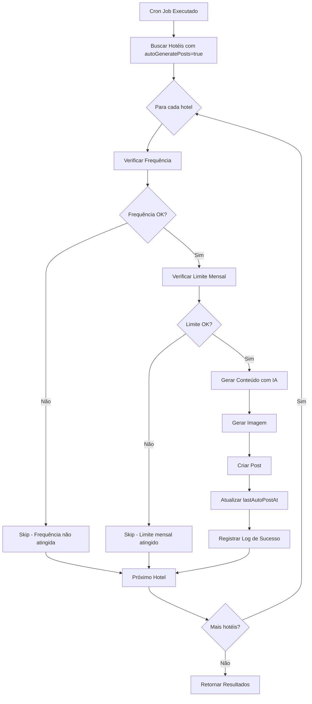

# Documentação da Feature de Automação de Posts

## Visão Geral

A feature de automação permite que hotéis configurem a geração automática de posts de blog usando Inteligência Artificial. O sistema utiliza o modelo Groq (Llama3-70b-8192) para gerar conteúdo e serviços de geração de imagens para criar posts completos automaticamente.

## Arquitetura do Sistema

### Componentes Principais

1. **Interface de Configuração** (`/dashboard/settings/automation`)
2. **API de Configurações** (`/api/settings/automation`)
3. **Sistema de Execução** (`/api/cron`)
4. **Sistema de Logs** (`/api/automation/history`)
5. **Página de Teste** (`/dashboard/test-automation`)

## Estrutura do Banco de Dados

### Modelo Hotel
```prisma
model Hotel {
  autoGeneratePosts   Boolean         @default(false)
  postFrequency       String?         // 'daily' | 'weekly' | 'biweekly'
  themePreferences    String?         // Preferências de tema
  maxMonthlyPosts     Int?            // Limite mensal de posts
  lastAutoPostAt      DateTime?       // Último post automático
  automationLogs      AutomationLog[]
}
```

### Modelo AutomationLog
```prisma
model AutomationLog {
  id        String   @id @default(cuid())
  hotelId   String
  postId    String?
  status    String   // success, error, pending
  message   String?
  createdAt DateTime @default(now())
  
  hotel     Hotel    @relation(fields: [hotelId], references: [id])
  post      Post?    @relation(fields: [postId], references: [id])
}
```

## Fluxo de Funcionamento

### 1. Configuração da Automação

**Endpoint:** `GET/PUT /api/settings/automation`

**Configurações Disponíveis:**
- `autoGenerate`: Ativar/desativar automação
- `postFrequency`: Frequência de publicação (diário, semanal, quinzenal)
- `maxMonthlyPosts`: Limite máximo de posts por mês
- `themePreferences`: Temas preferenciais para geração de conteúdo

**Permissões:**
- **Visualizar:** superadmin, admin (da rede), editor/viewer (do hotel)
- **Editar:** superadmin, admin (da rede), editor (do hotel)

### 2. Execução da Automação

**Endpoint:** `GET /api/cron`

**Agendamento:** Executa diariamente às 9:00 AM (configurado no `vercel.json`)

**Processo de Execução:**

1. **Busca hotéis elegíveis:**
   ```sql
   SELECT * FROM Hotel WHERE autoGeneratePosts = true
   ```

2. **Verifica condições para cada hotel:**
   - **Frequência:** Verifica se passou o tempo necessário desde o último post
   - **Limite mensal:** Verifica se não excedeu o limite de posts do mês

3. **Geração de conteúdo:**
   - Coleta contexto do hotel (nome, localização, tipo de viagem, público-alvo)
   - Gera título usando `generatePostIdeas()`
   - Cria conteúdo completo usando Groq API
   - Gera imagem usando `generateBlogImage()`

4. **Criação do post:**
   - Salva no banco com status `publishedAt: new Date()`
   - Atualiza `lastAutoPostAt` do hotel
   - Registra log de execução

### 3. Sistema de Logs

**Endpoint:** `GET /api/automation/history`

**Funcionalidades:**
- Histórico de execuções por hotel
- Status de cada execução (success, error, pending)
- Mensagens de erro detalhadas
- Referência ao post criado (quando aplicável)

**Permissões por Role:**
- **superadmin:** Vê todos os logs
- **admin:** Vê logs da sua rede
- **editor/viewer:** Vê logs do seu hotel

## APIs Detalhadas

### `/api/settings/automation`

#### GET - Buscar Configurações
```typescript
interface AutomationSettings {
  autoGenerate: boolean
  postFrequency: string
  maxMonthlyPosts: number
  themePreferences: string
}
```

#### PUT - Salvar Configurações
```typescript
// Body da requisição
{
  autoGenerate: boolean
  postFrequency: 'daily' | 'weekly' | 'biweekly'
  maxMonthlyPosts: number
  themePreferences: string
}
```

### `/api/cron`

#### GET - Executar Automação
```typescript
interface CronResponse {
  status: string
  processed: number
  results: CronResult[]
}

interface CronResult {
  hotelId: string
  status: 'success' | 'error' | 'skipped'
  title?: string
  reason?: string
  error?: string
}
```

### `/api/automation/history`

#### GET - Buscar Histórico
```typescript
interface AutomationLog {
  id: string
  status: string
  message: string | null
  createdAt: string
  hotel: {
    id: string
    name: string
  }
  post: {
    id: string
    title: string
    slug: string
  } | null
}
```

## Sistema de Permissões

### Funções de Autorização (`lib/auth.ts`)

```typescript
// Verificar se pode visualizar automação
function canViewAutomation(user: UserToken, targetHotel: any): boolean {
  if (user.role === 'superadmin') return true
  if (user.role === 'admin' && user.redeId === targetHotel.redeId) return true
  if (user.role === 'editor' && user.hotelId === targetHotel.id) return true
  if (user.role === 'viewer' && user.hotelId === targetHotel.id) return true
  return false
}

// Verificar se pode editar automação
function canEditAutomation(user: UserToken, targetHotel: any): boolean {
  if (user.role === 'superadmin') return true
  if (user.role === 'admin' && user.redeId === targetHotel.redeId) return true
  if (user.role === 'editor' && user.hotelId === targetHotel.id) return true
  return false
}

// Verificar acesso ao menu de automação
function canAccessAutomationMenu(role: string): boolean {
  return ['superadmin', 'admin', 'editor'].includes(role)
}
```

## Integração com IA

### Geração de Conteúdo (Groq)

**Modelo:** `llama3-70b-8192`
**Configurações:**
- `max_tokens`: 1000
- `temperature`: 0.7

**Prompt Template:**
```
Escreva um post de blog de 400 palavras com o título: "{title}"
Contexto: Hotel {name} da rede {rede}, localizado em {city}, {state}, {country}
Voltado para {travelType}, público {audience}, melhor época: {season}
Eventos locais: {events}
Preferências de tema: {themePreferences}

O post deve:
- Mencionar o hotel e rede
- Destacar a localização
- Ser direcionado para o público-alvo
- Considerar a época do ano
- Incluir informações sobre eventos locais
- Ter tom adequado ao tipo de viagem

Use um tom envolvente e informativo, incluindo dicas práticas.
```

### Geração de Imagens

**Serviço:** `generateBlogImage()` (configurado em `lib/image-service.ts`)
**Prompt:** `{title}, {hotelName}, {city}, {rede}, {season}`

## Monitoramento e Logs

### Sistema de Logging (`lib/automation-logger.ts`)

```typescript
interface AutomationLogData {
  hotelId: string
  status: 'success' | 'error' | 'pending'
  message?: string
  postId?: string
}

// Função para registrar execução
async function logAutomationExecution(data: AutomationLogData)
```

### Exemplo de Uso
```typescript
// Log de início
await logAutomationExecution({
  hotelId,
  status: 'pending',
  message: 'Iniciando geração de conteúdo via IA'
})

// Log de sucesso
await logAutomationExecution({
  hotelId,
  status: 'success',
  message: 'Post gerado com sucesso via IA',
  postId: generatedPost.id
})

// Log de erro
await logAutomationExecution({
  hotelId,
  status: 'error',
  message: `Falha ao gerar conteúdo: ${error.message}`
})
```

## Configuração de Deploy

### Vercel Configuration (`vercel.json`)
```json
{
  "functions": {
    "src/app/api/cron/route.ts": {
      "maxDuration": 30
    }
  },
  "crons": [
    {
      "path": "/api/cron",
      "schedule": "0 9 * * *"
    }
  ]
}
```

### Variáveis de Ambiente Necessárias
```env
GROQ_API_KEY=your_groq_api_key
JWT_SECRET=your_jwt_secret
DATABASE_URL=your_database_url
```

## Páginas da Interface

### 1. Configuração (`/dashboard/settings/automation`)
- Formulário para configurar automação
- Toggle para ativar/desativar
- Seleção de frequência
- Campo para limite mensal
- Área de texto para preferências de tema
- Modo somente leitura para viewers

### 2. Histórico (`/dashboard/automation/history`)
- Lista de execuções passadas
- Status visual (ícones de sucesso/erro/pendente)
- Filtros por hotel (para admins/superadmins)
- Links para posts gerados
- Mensagens de erro detalhadas

### 3. Teste (`/dashboard/test-automation`)
- Botão para executar automação manualmente
- Exibição de resultados em tempo real
- Útil para testes e debugging

## Fluxo de Decisão da Automação



## Considerações de Segurança

1. **Autenticação:** Todas as APIs verificam token JWT
2. **Autorização:** Permissões baseadas em roles e hierarquia
3. **Rate Limiting:** Limite de 30 segundos para execução do cron
4. **Validação:** Validação de dados de entrada em todas as APIs
5. **Logs:** Registro detalhado de todas as operações

## Troubleshooting

### Problemas Comuns

1. **Posts não sendo gerados:**
   - Verificar se `autoGeneratePosts` está ativo
   - Verificar frequência configurada vs. `lastAutoPostAt`
   - Verificar limite mensal
   - Verificar logs de erro

2. **Erro 400 na API de configurações:**
   - Verificar se usuário tem permissão
   - Para superadmins, verificar se existe pelo menos um hotel

3. **Falha na geração de conteúdo:**
   - Verificar `GROQ_API_KEY`
   - Verificar conectividade com API externa
   - Verificar logs detalhados

### Logs Úteis

```bash
# Verificar execução do cron
console.log('🤖 Iniciando processo de automação de posts...')

# Verificar hotéis encontrados
console.log(`📊 Encontrados ${hotels.length} hotéis com automação ativada`)

# Verificar geração de conteúdo
console.log(`💡 Título gerado: ${title}`)
console.log(`📄 Conteúdo gerado (${content.length} caracteres)`)
console.log(`🖼️ Imagem gerada: ${imageUrl}`)
```

## Melhorias Futuras

1. **Agendamento Flexível:** Permitir horários personalizados por hotel
2. **Templates de Conteúdo:** Templates pré-definidos por tipo de hotel
3. **Análise de Performance:** Métricas de engajamento dos posts automáticos
4. **Integração com Redes Sociais:** Publicação automática em redes sociais
5. **Aprovação Manual:** Workflow de aprovação antes da publicação
6. **A/B Testing:** Testes de diferentes estilos de conteúdo
7. **Personalização Avançada:** IA mais contextual baseada em dados históricos